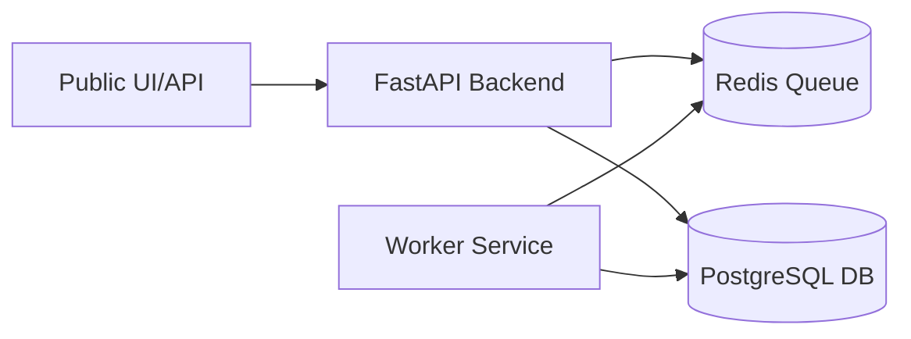

# Containerized Microservices Lab (K8s Ready) ☸️

This project is a multi-service task processing application designed to teach **Docker** and **Kubernetes** from the ground up.

As your mentor, I'll guide you through each stage. You'll be the one writing the code and YAML scripts.

## 🏗️ Architecture

### Components
1. **Backend**: FastAPI Web API for ingress and task submission.
2. **Worker**: Python background processor that consumes tasks.
3. **Redis**: Message broker/queue.
4. **PostgreSQL**: Result persistence.
5. **K8s Manifests**: Where the "infra-heavy" magic happens.

---

## 🚦 Getting Started

1. **Prerequisites**:
   - Docker Desktop (with Kubernetes enabled).
   - `kubectl` (installed with Docker Desktop).
   - Python 3.10+.

2. **Stage 1: Containerization**
   Start by navigating to `backend/Dockerfile`.

---

> [!NOTE]
> This project uses `pyproject.toml` for dependency management.
